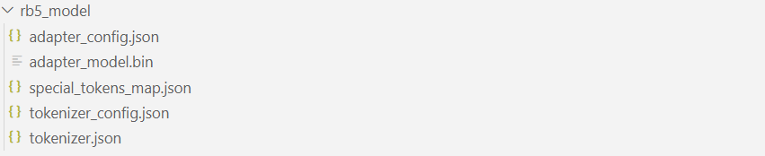
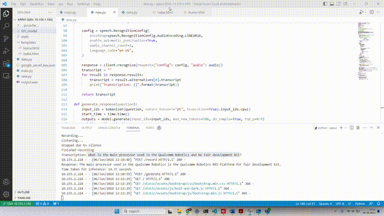

# SLM Model Compilation and integration
## Introduction
The rapid advancement of artificial intelligence and machine learning has paved the way for sophisticated conversational agents capable of understanding and responding to human language. This project focuses on leveraging the Google T5-Small model, a powerful transformer-based model, for inference tasks on the Qualcomm RB5 platform. The primary objective is to create a voice-enabled chatbot tailored to handle queries related to Qualcomm technologies and services.

The project encompasses several key components:

### Model Training:

The Google T5-Small model will be fine-tuned using a dataset specific to Qualcomm. This dataset will include various queries and responses pertinent to Qualcomm’s technologies, products, and services. The fine-tuning process will enhance the model’s ability to generate accurate and contextually relevant responses.

### Voice Command Integration:

To facilitate seamless interaction, the chatbot will be equipped with voice recognition capabilities. Users will be able to input queries through voice commands, which will be converted to text for processing by the T5-Small model.

### Inference and Response Generation:

The T5-Small model will perform inference on the input text, generating appropriate responses. This step leverages the model's pre-trained language understanding and generation capabilities, fine-tuned for the specific use case.

## Prerequisites: 

1. Install Android Platform tools (ADB, Fastboot) 

2. Download and install the SDK Manager for RB5. Link as given below https://developer.qualcomm.com/software/qualcomm-neural-processing-sdk/tools  

3. Flash the RB5 firmware image on to the RB5 

4. Setup the Network on RB5 using below link https://developer.qualcomm.com/qualcomm-robotics-rb5-kit/quick-start-guide/qualcomm_robotics_rb5_development_kit_bring_up/set-up-network  


## Steps to fine-tune the google T5-small model

### Installing Dependencies

#### Install Conda  by using the below given link.
 https://thesecmaster.com/step-by-step-guide-to-install-conda-on-ubuntu-linux/

- After Installation, create the conda environment by using the given commands
  ``` sh 
    $ conda create --name <env_name>
  ```
- To check the conda environment list & activate

  ```sh
    $ conda env list
    $ conda activate <env_name>
  ```
- Create the new conda env and run the requirements for fine-tunning the model
  ``` sh
    shell$ pip install -r requirements.txt 
  ```

### Data Example
-  Collect data relevant to your use case, which can be found in the SLM/Training directory. This directory contains both the training and test datasets necessary for model development and evaluation.


| id | question | answer |
|---|---|---|
| 0 | What is the main processor used in the Qualcomm Robotics RB5 development kit? | The main processor used in the Qualcomm Robotics RB5 development kit is the QRB5165 processor. |
| 1 | What are some key features of the RB5 development kit? | Some key features of the RB5 development kit include high-speed wireless connectivity, high-accuracy artificial intelligence (AI) and machine-learning inferencing technology, and support for power-efficient, high-computing robots and drones for enterprise, industrial, and professional service applications. |

- Collect Data: Gather your dataset and save it in CSV format.
- Organize Data: Place the collected data into the data folder.
- File Naming: Ensure the CSV files are named as follows:
    - Training data: train.csv
    - Testing data: test.csv

Make sure the data folder contains these two files before proceeding with the next steps.

### Training Information

The model was trained for 50 epochs with a learning rate of 1e-3 to ensure efficient and effective learning. Here are the key details of the training configuration:

- Epochs: 50 epochs, representing complete passes through the training dataset to achieve optimal performance.

- Learning Rate: Set to 1e-3 to accelerate the training process while maintaining stability.

- Batch Size: Dynamically determined using auto_find_batch_size for efficient GPU memory utilization.

- Model: google/flan-t5-small, designed for tasks like text summarization and question answering.
- LoRA Configuration:

  - r=16
  - lora_alpha=32
  - Target modules: ["q", "v"]
  - lora_dropout=0.05
  - Task type: SEQ_2_SEQ_LM

  LoRA fine-tunes a subset of model parameters, reducing computational resources required.
- Data Collator: DataCollatorForSeq2Seq used to handle padding, with label_pad_token_id set to -100 to ignore padding tokens in loss computation.
- Logging: Training progress logged every 500 steps, reported to TensorBoard.
- Int8 Training: Model prepared for int8 (8-bit integer) training to optimize memory usage and speed without significant accuracy loss.

By combining these techniques, the model efficiently learned and generalized from the training data, ensuring enhanced performance and effective fine-tuning with LoRA.

### Fine-tune the Google T5 Model

- Execute the fine-tuning script located in the SLM/Training directory.

  ``` sh
    shell$ python3 Training/t5_tuning.py
  ```

Upon successful fine-tuning, it will generate the rb5_model, customized for your specific use case.



## Setting Up Google Cloud Service Account
### Set up Google Cloud Speech-to-Text credentials
### Step 1: Set Up Google Cloud Project
1. **Create a Google Cloud Project**:
   - Go to the [Google Cloud Console](https://console.cloud.google.com/).
   - Click on the project drop-down in the top bar.
   - Click "New Project".
   - Enter a project name and select a billing account if prompted.
   - Click "Create".

2. **Select your project**:
   - After the project is created, select it from the project drop-down in the top bar.

### Step 2: Enable APIs
1. **Enable necessary APIs**:
   - Go to the [API Library](https://console.cloud.google.com/apis/library).
   - Search for the APIs you need (e.g., Google Drive API, Google Sheets API, etc.).
   - Click on each API and then click "Enable".

### Step 3: Create Service Account
1. **Navigate to the IAM & Admin section**:
   - Go to the [IAM & Admin section](https://console.cloud.google.com/iam-admin/serviceaccounts) in the Google Cloud Console.
   - Click "Service Accounts" in the left-hand menu.

2. **Create a new service account**:
   - Click "Create Service Account".
   - Enter a service account name, ID, and description.
   - Click "Create and Continue".

3. **Grant the service account permissions**:
   - Select roles that the service account needs. For example, if you need to access Google Cloud Storage, you might grant the "Storage Admin" role.
   - Click "Continue".

4. **Grant users access to the service account**:
   - You can skip this step if you don't need to grant any users access to the service account.
   - Click "Done".

### Step 4: Create and Download Service Account Key
1. **Generate a key for the service account**:
   - In the service accounts list, find the service account you created.
   - Click the "Actions" button (three vertical dots) for that service account.
   - Click "Manage keys".
   - Click "Add Key", then select "Create new key".
   - Choose "JSON" as the key type and click "Create".

2. **Download the key**:
   - The JSON file containing your service account key will be downloaded automatically. This file contains the information needed to authenticate with Google Cloud services.

### Step 5: Use the Service Account Key
1. **Secure your key**:
   - Store this JSON key file securely. Do not share it or check it into source control.

2. **Authenticate with the service account**:
   - Use this key file in your application to authenticate with Google Cloud services.

By following these steps, you will create a new Google Cloud service account and obtain the necessary credentials for accessing Google Cloud services.

In this project this is used in `app.py` python file.
## SLM Model Inference on RB5

- To deploy the custom model and simple UI to the RB5, follow these steps:

-   Prepare the Files:

    - Place the custom model and the simple UI in a folder.
    - Transfer the Files:
      
      Using SSH:
      ``` sh
        ssh root@<ip_rb5>
        scp -r <path_to_your_folder> root@<ip_rb5>:<destination_path_on_rb5>
      ```
      Using ADB:
      ``` sh
        adb push <path_to_your_folder> <destination_path_on_rb5>
      ```

Replace <ip_rb5> with the IP address of your RB5, <path_to_your_folder> with the local path to your folder, and <destination_path_on_rb5> with the desired destination path on the RB5.


- Start the Flask Application: Run the inference script to launch the Flask application.
   
   ``` sh
    sh4$ python3 app.py
  ```
  This command will start the Flask server on rb5_ip:5000.

- Use the Web Interface:
Open a web browser and navigate to the Flask application's address (http://rb5_ip:5000). The user interface will be displayed.

- Record and Process: Click the "Record and Process" button on the UI. You can now ask your question using voice commands.

- Voice to Text Translation: The system will capture your voice input, translate it to text, and send it to the fine-tuned model for processing.

- Display Generated Output: The model will generate a response based on the input question, and the output will be displayed on the screen in the user interface.

Demo:

  -    


